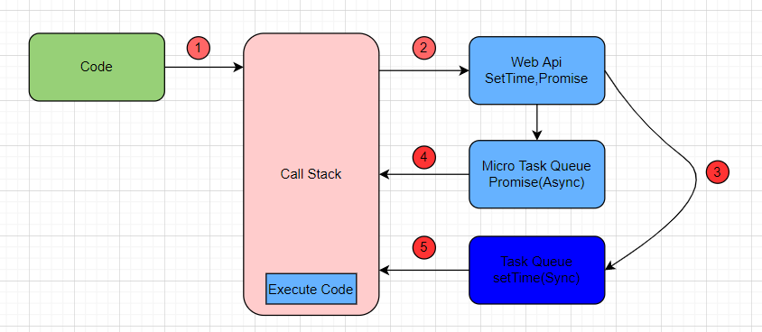

# Event Loop

## Web Api

Web APIs 並不屬於 JavaScript 語言本身，而是由瀏覽器提供並且負責處理非同步操作。

### (1) Call Stack（調用堆疊）

JavaScript 會把同步的程式碼 逐行執行，並將函式推進 Call Stack。
只有 Call Stack 清空 後，事件迴圈（Event Loop）才會開始處理異步操作。

### (2) Web APIs

當 JavaScript 執行 setTimeout、fetch 或 DOM 事件時，它們會被送到 Web APIs 處理，並不會阻塞主執行緒。

### (3) Callback Queue（回調佇列）

當 Web API 處理完畢後，它會將對應的回調函式推進 Callback Queue（佇列）。
這些回調不會立即執行，而是等 Call Stack 清空後再處理。

### (4) 微任務（Microtask Queue） vs. 巨任務（Macrotask Queue）

微任務（Microtasks）

Promise.then() / queueMicrotask() / MutationObserver
優先級高，會在下一次 Event Loop 開始前先執行完畢。
巨任務（Macrotasks）

setTimeout() / setInterval() / fetch() / I/O
優先級較低，等 Call Stack 空了才會被執行。

- Code 移到 Call Stack : 執行
- async,sync : 移動到 Web Api
- sync : 移動到 Task Queue
- async : 移動到 Micro Task Queue
- If Call Stack is Empty then Check Micro Task Queue
- Execute Micro Task Queue
- Execute Task Queue
