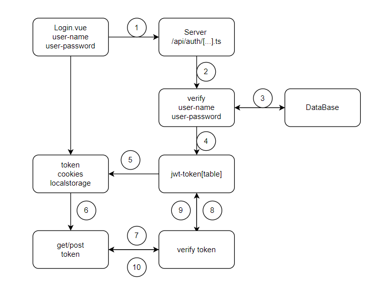

# server 端驗證

## 使用 NuxtAuthHandler

[Nuxt-Auth 官方文件](https://auth.sidebase.io/guide/authjs/nuxt-auth-handler)
/server/api/auth/[...].ts

```ts
// server/api/auth/[...].ts
import {NuxtAuthHandler} from "#auth";
import Credentials from "@auth/core/providers/credentials";

export default NuxtAuthHandler({
  secret: process.env.NUXT_SECRET || "your-development-secret",
  // 为生产环境设置 origin
  origin:
    process.env.NODE_ENV === "production"
      ? process.env.NUXT_PUBLIC_SITE_URL
      : "http://localhost:3001",
  providers: [
    Credentials({
      name: "credentials",
      credentials: {
        email: {label: "Email", type: "email"},
        password: {label: "Password", type: "password"},
      },
      async authorize(credentials: any) {
        // 简化的验证逻辑示例
        if (
          credentials.email === "test@example.com" &&
          credentials.password === "password"
        ) {
          console.log("OK");
          return {id: "1", email: "test@example.com", name: "Test User"};
        }
        return null;
      },
    }),
  ],
  pages: {
    signIn: "/login",
  },
});
```

# 使用者登入畫面 (Login.vue)

```vue
<!-- pages/test-auth.vue -->
<template>
  <Card class="card-login">
    <CardHeader>
      <CardTitle class="flex  justify-center items-center text-2xl">
        <span class="px-2 text-blue-800">使用者登入</span>
      </CardTitle>
      <CardDescription class="flex items-center">
        <Mail color="green" />
        <span class="px-2 text-green-500 font-bold text-lg"
          >輸入電子郵件登入帳號</span
        >
      </CardDescription>
    </CardHeader>
    <CardContent class="grid gap-4">
      <div class="grid gap-2">
        <p v-if="emailError" class="text-red-500 text-sm font-bold">
          *{{ emailError }}
        </p>
        <Label for="email" class="text-gray-800 font-bold">電子郵件</Label>
        <Input
          id="email"
          type="email"
          v-model="email"
          placeholder="m@example.com"
          required />
      </div>
      <div class="grid gap-2">
        <p v-if="passwordError" class="text-red-500 text-sm font-bold">
          *{{ passwordError }}
        </p>
        <Label for="password" class="text-gray-800 font-bold">使用者密碼</Label>
        <Input id="password" v-model="password" type="password" required />
      </div>
    </CardContent>
    <CardFooter>
      <Button
        class="w-full bg-blue-500 text-white font-bold hover:bg-blue-800"
        @click="handleSignIn">
        登入
      </Button>
    </CardFooter>
  </Card>
</template>

<script setup lang="ts">
import {Mail} from "lucide-vue-next";
const redirectURL = "/about";
definePageMeta({
  layout: "default-no", // 指定使用 custom layout
});
const email = ref("test@example.com");
const password = ref("password");
const emailError = ref("");
const passwordError = ref("");
const {data, status, signIn, signOut} = useAuth();
function validateInputs() {
  // 重置錯誤信息
  emailError.value = "";
  passwordError.value = "";

  // 使用較完整的電子郵件驗證正則表達式
  const emailPattern = /^[a-zA-Z0-9._%+-]+@[a-zA-Z0-9.-]+\.[a-zA-Z]{2,}$/;

  // 電子郵件驗證
  if (!email.value.trim()) {
    emailError.value = "請輸入電子郵件";
  } else if (!emailPattern.test(email.value)) {
    emailError.value = "電子郵件格式不正確";
  }

  // 密碼驗證
  if (!password.value) {
    passwordError.value = "請輸入密碼";
  } else if (password.value.length < 6) {
    passwordError.value = "密碼長度至少 6 個字元";
  }

  // 返回驗證結果
  return !emailError.value && !passwordError.value;
}
async function handleSignIn() {
  if (!validateInputs()) return;
  try {
    const result = await signIn("credentials", {
      email: email.value,
      password: password.value,
      redirect: false,
    });

    if (result) {
      navigateTo(redirectURL); // 成功後跳轉
    }

    console.log("登錄结果:", result);
  } catch (e) {
    console.error("登錄错误:", e);
  }
}
</script>

<style scoped>
.card-login {
  @apply w-full sm:w-1/2 md:w-1/2 lg:w-1/3;
}
</style>
```

# 使用者登入


